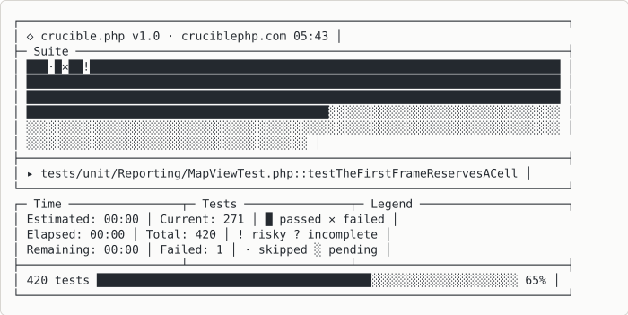
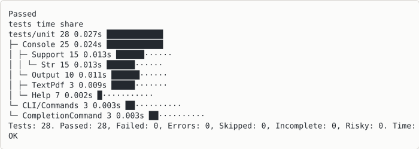
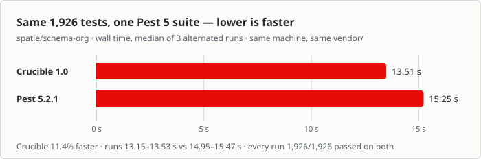
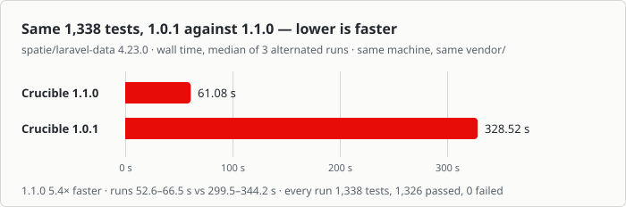

<p align="center">
  
</p>

# Crucible PHP

**An independent, XML-free test framework for PHP 8.3+ — drop-in compatible with PHPUnit
suites, engineered like the best runners of other ecosystems.**

```bash
composer require --dev cruciblephp/crucible
./vendor/bin/crucible --init
./vendor/bin/crucible
```



And when it finishes — where the time went, in columns, with the verdict last:



On a real Pest 5 suite, faster than Pest itself — same 1,926 tests, same machine, alternated
runs; method and raw times in [`benchmarks/manifest.json`](benchmarks/manifest.json):



And 1.1.0 against 1.0.1 on spatie/laravel-data, a Pest suite on Orchestra Testbench, where discovery
and each test class's setup cost 1.0.1 the most:



Already have a `phpunit.xml`? `./vendor/bin/crucible migrate-config` converts it, and tells you
about anything it could not translate rather than dropping it silently.

---

## Requirements

**PHP 8.3 or newer, and nothing else.** No runtime dependencies — the extensions below ship
with a stock PHP build.

| | |
|---|---|
| PHP | `>= 8.3` |
| Extensions | `ext-dom`, `ext-mbstring`, `ext-simplexml` |
| Composer dependencies | none |
| Optional | `ext-xdebug` or `ext-pcov` for coverage · Node for the browser tier |

The floor is deliberate: a suite on 8.3 should not have to move the whole project to a newer
PHP to change test runner.

---

## Start here

```bash
./vendor/bin/crucible manual
```

The whole manual, in the terminal: ↑/↓ to scroll, `/` to search, number keys to follow a link,
⌫ to go back, `q` to quit. Piped or in CI it prints the same text plainly.

```bash
./vendor/bin/crucible manual --out=manual.pdf   # the same text, as a PDF
eval "$(./vendor/bin/crucible completion bash)" # tab completion: bash, zsh or fish
```

Everything below is a summary. The manual is the real document.

---

## Three dialects, one run

```php
// PHPUnit — your existing suite, unchanged.
final class CalculatorTest extends TestCase
{
    public function testAddsTwoNumbers(): void
    {
        $this->assertSame(4, 2 + 2);
    }
}

// Pest — *.pest.php, natively.
it('rounds up', fn() => expect((int) ceil(1.2))->toBe(2));

// Architecture is a test, not a linter.
arch('the domain stays pure')->expect('App\Domain')->toOnlyUse('App\Domain');

// The browser is a first-class tier: the server runs inside the test
// process, so whatever the test faked is what the page sees.
visit('/checkout')->click('Place order')->waitForNetworkIdle()->assertSee('Thank you');
```

Every sample is from [`examples/`](examples), and those files are **run by the test suite** —
an example that stopped working turns the suite red.

---

## PHPStan, built in

Crucible ships its own PHPStan extension. With
[`phpstan/extension-installer`](https://github.com/phpstan/extension-installer) there is nothing to
wire; without it, `crucible phpstan-init` writes the one include line. It covers what phpstan-phpunit
and pest-plugin-phpstan give a migrated suite — assertions narrow, `expect()` is generic, `$this` is
typed in Pest closures — held line by line against both. And it goes further:

```php
expect($x)->toBeString();          // $x itself is a string now, not only the chain
expect($user)->toMatchShape('array{id: positive-int, tags: list<string>}');
                                   // checked when the test runs, narrowed for PHPStan
```

Dataset rows that the test cannot take are reported before anything runs, `assertType()` calls in
`*.types.php` files are tests in the run, and `Gen::of('<type>')` draws property-test data from a
type string.

---

## Documentation

| | |
|---|---|
| `crucible manual` | All of it, in the terminal |
| [MANUAL.md](MANUAL.md) | The same document, on the web |
| [HELP.md](HELP.md) | Every command-line option |
| [examples/](examples) | Executable examples, run by the suite |
| [RELEASE.md](RELEASE.md) | What shipped, traced to its decision record |
| [DESIGN.md](DESIGN.md) | Why each thing is the way it is |
| [ORACLES.md](ORACLES.md) | The real installs some tests run against, and how to rebuild them |

---

## The idea

**Spec, not source.** Crucible is a clean-room implementation. PHPUnit defines the *behavioral
spec* — assertions, attributes, CLI options, defaults, exit codes — established from public
documentation and black-box observation of the binary, never read as source. No code,
templates, doc comments, or message text are copied from any project.

**Compatibility is executable, not claimed.** 19 fixture suites run against *both* the real
`phpunit` binary and `crucible`, asserting identical outcomes, sequences, counts, issue tallies
and exit codes. Every machine-readable report — Clover, Cobertura, Crap4J, JUnit, TeamCity,
coverage XML — is compared against the incumbent's own writer too, by structure *and* by the
numbers inside it.

**If it can be done better, do it better.** A versioned NDJSON event stream as the single
output substrate, supervisor/worker execution where that stream *is* the IPC, duration-aware
and defects-first scheduling, VMVM-style state isolation, Ekstazi-style impact selection.

[DESIGN.md](DESIGN.md) has the reasoning, decision by decision.

---

**The code is MIT.** The name "Crucible" and the Crucible logo are trademarks of Luciano
Federico Pereira and are **not** covered by that licence — see [LICENSE](LICENSE). Fork the
software freely; do not ship it under this name or mark.

© 2026 Luciano Federico Pereira · [cruciblephp.com](https://cruciblephp.com)
